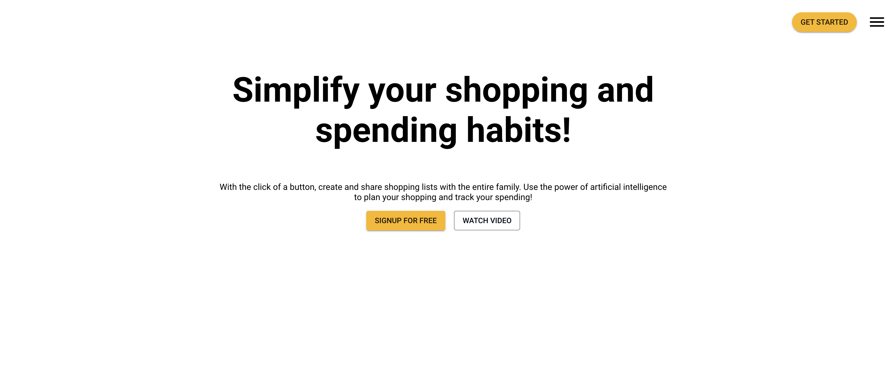
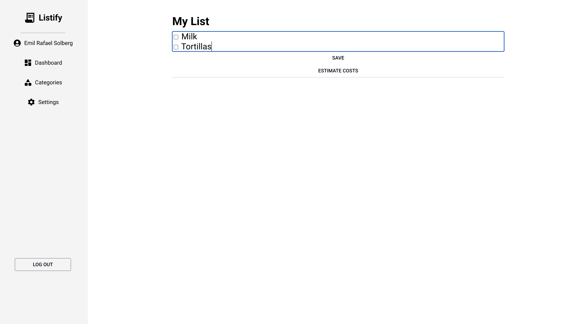

# Listify: Shopping List and Budget Estimator

This web application is designed to help users create shopping lists and estimate budgets using the OpenAI API. Built with Spring Boot for the backend and React for the frontend, this project provides a robust and user-friendly interface for managing shopping activities efficiently.

## Features

- **Create and Manage Shopping Lists**: Users can create multiple shopping lists and add items as needed. Seamlessly edit your lists in the
  editor, powered by Slate!
- **Budget Estimation**: Utilizes the OpenAI API to estimate costs and suggest budget-friendly options.
- **User Authentication**: Secure login with OAuth2 and Spring security allowing you to login with your Google account.
- **Responsive Design**: Ensures a seamless experience across all devices.

## Technology Stack

- **Backend**: Spring Boot
- **Frontend**: React
- **APIs**: OpenAI
- **Database**: PostgreSQL
- **Other Technologies**: Docker

## Screenshots

### Landing page

### List Page

